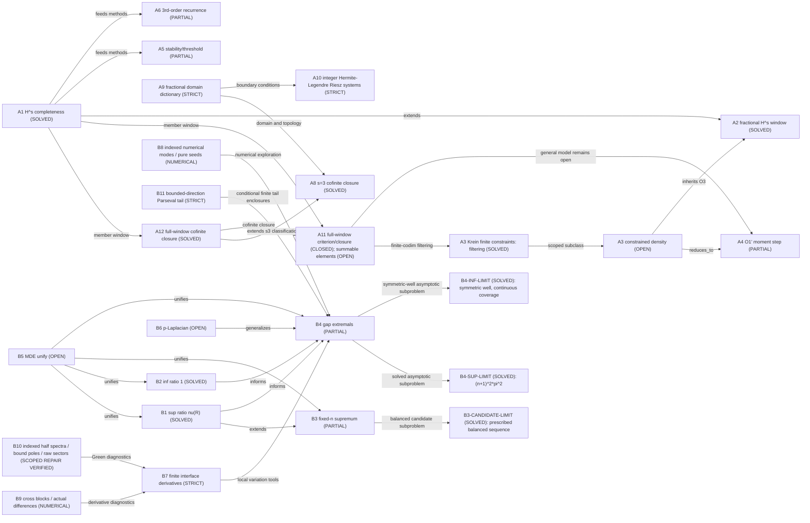

# Research map: Sturm-Liouville spectral optimization (BVE research)

Navigation updated: 2026-10-08. Mathematical scopes below retain the existing R14--R16 results; this maintenance adds no theorem or acceptance.

[首页](README.md) | [按问题选择证明](docs/research-guide.md) | [当前续接](state/RESUME.md) | [数学理解](docs/PROJECT_UNDERSTANDING.md)

## How to read this map

This is the human-maintained problem--result--remaining-gap overview. Stable node IDs and dependency relations are preserved. SOLVED/STRICT describe only the exact scope in that row, PARTIAL leaves the stated gaps open, NUMERICAL denotes finite diagnostic evidence. The map is not a proof or a Blueprint/library/Lean acceptance record.

Follow each actual proof and its report, then check prerequisites and replacement relationships in the research guide. Independent analytic review, software execution, retrieval, automated reception, canonical integration, formalization and remote publication are separate. A newer navigation date does not extend any result.

## Entry points

- [研究导航](docs/research-guide.md): recommended proofs and necessary prerequisites by mathematical problem.
- [目录及源/PDF关系](docs/repository-guide.md): some complete proofs are Markdown-only; historical PDFs retain their original roles.
- [工具入口](tools/README.md), [脚本入口](scripts/README.md): card gates and current numerical/certificate interfaces.
- [Lean 状态](lean-proof/STATUS.md): inspect the exact declarations, hypotheses and bound code/logs.
- [R14](reports/proof-audit-round14-20261004/REPORT.md), [R15](reports/proof-audit-round15-20261005/REPORT.md), [R16](reports/proof-audit-round16-20261006/REPORT.md): scoped evidence and original failed reviews.

## Two research lines

### Line A - Left-definite theory / completeness of sparse polynomial systems

| Id | Problem | Status | Key result / pointer | Notes |
| --- | --- | --- | --- | --- |
| A1 | `{p_n}` density in genuine H^s, 0 <= s < 7/2 (Krein-Sobolev) | SOLVED | [完整成员窗口](docs/SL_fractional_left_definite.tex); [R6](reports/proof-audit-round6-20260921/REPORT.md) | Round6 four-trace graph core + spectral cutoff proves the full window; every nonaffine named member has threshold7/2, affine modes survive all nonnegative orders. No deleted-family or arbitrary-V extension |
| A2 | Fractional left-definite H^s, 3/2 <= s < 2, sparse-family density | SOLVED | [分数阶证明](docs/SL_fractional_left_definite.tex) | covered by A1 via H3 density and spectral truncation, 2026-09-20; no claim for arbitrary constrained spaces |
| A3 | Density in constrained subspace V, general non-coordinate H | OPEN (general); diagonal Theorem E and Krein finite-codimension subclass SOLVED | [修后准则](tools/constrained-denseness-runs.md); A3-KREIN-FINITE below | General A4, infinite constraints and projected/recombined families are separate |
| A4 | O1' moment-representability + membership step | PARTIAL | [受约束证明与原 run](tools/constrained-denseness-runs.md); [R6 修复](reports/proof-audit-round6-20260921/REPORT.md) | CLOSED on H_beta + finite polynomial constraints; general H OPEN |
| A5 | Conditional moment-jump stability and actual-solution criterion | PARTIAL | [稳定性证明](docs/SL_stability_moment_jump.tex); [R3](reports/proof-audit-round3-20260920/REPORT.md) | General product lower bound only; B=0 diagonal models classified; unconditional bounded basis-perturbation stability refuted (round 3) |
| A6 | Three-order recurrence theory (fixed point / closed forms / minimal solution) | PARTIAL | [指定族证明](docs/SL_third_order_recurrence_theory.tex); [K1 锚点](docs/SL_third_order_K1_proof.tex); [R4](reports/proof-audit-round4-20260921/REPORT.md) | specified even/odd P,Q,R: positive minimal solution and K0(c)/K1(c) for c>0, rational ratios classified in round4; nonhomogeneous source control and arbitrary families remain OPEN |
| A7 | Krein algebraic polynomial inverse versus operator power domain | STRICT | [域障碍](tools/krein-power-domain-polynomial-obstruction.md); [pilot-v6](runs/three-arm-pilot-v2/pilot-v6-hs-domain/RESULTS.md) | for every c>0 and integer s>=4, membership holds exactly for n=0,1; genuine operator inverses are dense but generally non-polynomial; boundary-compatible polynomials form a graph core with exact degrees `{0,1} union {N:N>=2 floor(s/2)+2}` |
| A8 | Cofinite original-family closure at s=3 | SOLVED | [s=3 证明](literature/absorption-20260923/domains/proofs/03-s3-cofinite-closure.md); [吸收报告](reports/literature-absorption-20260923/REPORT.md) | Fixed c>0. Closure is determined exactly by retention of indices0,1,4, detecting f(0),f′(0),f″(0); high-tail sufficiency proved. The original s3 proof has that scope; A12 now covers critical s=5/2. No general infinite-deletion conclusion |
| A9 | Concrete fractional and critical power-domain dictionary | STRICT | [域字典](tools/krein-fractional-trace-dictionary.md); [幺正桥](tools/krein-parity-unitary.md) | All s≥0 in this smooth constant-coefficient model via full-interval Neumann/shifted-Robin bridge; ordinary boundary layers off3/2+2k and weighted critical residuals at equality |
| A10 | Hermite-integrated Legendre Riesz replacement systems, every integer order | STRICT (scoped independent analytic review) | [完整整数证明](docs/SL_integer_left_definite_riesz_systems.md); [R16](reports/proof-audit-round16-20261006/REPORT.md) | Every fixed c>0 and integer r>=0, true complex power domain, 2ceil(r/2) low lifts (odd r needs r+1), degree-independent Riesz bounds and exact polynomial span. Rates need weighted coefficients with t>=0. Not original sparse-family Riesz, noninteger orders or uniform c->0 |
| A11 | Arbitrary retained sets throughout the full Krein member window | Density criterion / divergent closure CLOSED; summable closure description PARTIAL | [完整全窗口证明](docs/SL_full_window_deletions_and_finite_constraints.md); [R15](reports/proof-audit-round15-20261005/REPORT.md) | Fixed c>0, 0<=s<7/2, arbitrary N. Both parity reciprocal sums divergent: exact omitted continuous-center-trace closure with I(s)={}, {0}, {0,1}, {0,1,4}; equalities1/2,3/2,5/2 use fewer traces. Either convergent: infinite codimension. Dense iff both divergent and I(s) subset N. Full summable-space description remains open |
| A3-KREIN-FINITE | Individual-member filtering under finite continuous complex constraints in genuine Hc^s | SOLVED (scoped independent analytic review) | [完整证明第 7 节](docs/SL_full_window_deletions_and_finite_constraints.md#7-任意有限个连续约束下的逐项筛选分类); [R15](reports/proof-audit-round15-20261005/REPORT.md) | Fixed c>0, 0<=s<7/2: filtered family dense in V iff V is an intersection of a subset of current continuous central trace coordinate kernels; 1/2/4/8 distinct subspaces. No general H, infinite constraints, projection or recombination theorem |
| A12 | Cofinite closure throughout the full member window | SOLVED (independent analytic review) | [A12 源证明](docs/SL_cofinite_all_orders.tex); [阅读版](docs/SL_cofinite_all_orders.pdf); [R11](reports/proof-audit-round11-20260926/REPORT.md) | Fixed c>0, 0<=s<7/2. Essential retained indices are {}, {0}, {0,1}, {0,1,4} on [0,1/2], (1/2,3/2], (3/2,5/2], (5/2,7/2). Missing indices impose respectively f(0), f′(0), f″(0); codimension is their count. Delete p6: still dense, so every nonzero scaling/reordering of the original family is non-Schauder/Riesz. No arbitrary infinite deletion or uniform c→0 claim |

### Line B - Eigenvalue ratios and spectral gaps of weighted Dirichlet SL

| Id | Problem | Status | Key result / pointer | Notes |
| --- | --- | --- | --- | --- |
| B1 | sup_{n,rho} lambda_{n+1}/lambda_n = nu(R) | SOLVED | [上确界证明](docs/SL_ratio_proof.tex) | balanced-phase closed form |
| B2 | inf_{n,rho} lambda_{n+1}/lambda_n = 1 | SOLVED | [下确界证明](docs/SL_inf_ratio_proof.tex) | Constant-density high modes suffice; inf not attained |
| B3 | Fixed-n supremum Lambda_n^sup(R) | PARTIAL | [候选谱证明](docs/SL_fixed_n_supremum.tex); [R9](reports/proof-audit-round9-20260923/REPORT.md) | physical reflection has a frequency factor; normalized symmetry and all-n root count repaired in round9. Historical extremizer 2n-switch structure retains its scope; global equality/optimality O1/O2 OPEN |
| B3-CANDIDATE-LIMIT | Prescribed balanced candidate ratios c_n(R), fixed R>1 | SOLVED | [指定候选证明](docs/SL_fixed_n_supremum.tex); [R9](reports/proof-audit-round9-20260923/REPORT.md) | Jacobi principal submatrix argument gives c_n strictly decreasing to ((pi-phi)/phi)^2, phi=arccos((sqrt(R)-1)/(sqrt(R)+1)). Does not identify c_n with the global supremum |
| B4 | Adjacent gap extremals D_n = lambda_{n+1}-lambda_n | PARTIAL | [n=1](docs/SL_gap_n1_proof.tex); [局部框架](docs/SL_gap_nge2_symmetry_local_proof.tex); [完整 G2](docs/SL_G2_compactness_proof.md); [R14](reports/proof-audit-round14-20261004/REPORT.md) | n=1 all-R chain retained; n>=2 small-contrast uniqueness repaired in round7; general SUP limit is solved as B4-SUP-LIMIT below. M3/KP retain their explicit chart scopes; G2 now covers all exact zeros uniformly on 1<=R<=Rmax (Round14); all-zero Jacobian nondegeneracy ND remains open; finite-R global uniqueness remains OPEN |
| B4-SUP-LIMIT | lim_(R->infinity) sup_(1<=rho<=R) D_n, fixed n>=1 | SOLVED | [一般 SUP 极限](docs/SL_gap_nge2_symmetry_local_proof.tex); [R7](reports/proof-audit-round7-20260921/REPORT.md) | Limit=(n+1)^2*pi^2 for measurable box and unrestricted finite-piecewise classes; 4*pi^2 only at n=1. Does not identify finite-R maximizing interfaces or prove every self-consistent branch reaches that limit |
| B4-INF-LIMIT | Symmetric [R,1,R] first-gap scaled infimum and near-minimizers | SOLVED | [对称阱极限](docs/SL_gap_n1_inf_limit_proof.tex); [R8](reports/proof-audit-round8-20260922/REPORT.md) | R*m_R→M≈24.9438661384 with nonnegative O(1/R) error; near-minimizers require R*eta_R→0. Entire thin-layer region covered by continuous phase speed; large-w comparison has positive margin. T1 uses T2 analytically, not T3 numerical constants. No new all-box/nonsymmetric/n>=2 claim |
| B5 | MDE extremal measure unified theory | OPEN | [综述开放问题](docs/SL_spectral_topics_summary.tex) | unifies nodes/largest gap via extremal measures |
| B6 | p-Laplacian / nonlinear generalizations | OPEN | [综述开放问题](docs/SL_spectral_topics_summary.tex) | Wen-Zhou singularity technique scope |
| B7 | Local second variation along finite fixed-value moving interfaces | STRICT | [有限界面公式](tools/finite-interface-second-derivative.md); [原推导](literature/absorption-20260923/interfaces/derivations/) | Ordered noncolliding internal interfaces, fixed positive block values, simple fixed mode; normalization, finite Green kernel, geometry and coordinate acceleration retained. No global sign/G1′ or arbitrary distribution-path differentiability |
| B8 | Indexed numerical spectrum and geometrically pure reflection seeds | NUMERICAL (independently reviewed) | [相位枚举](scripts/_sl_prufer.py); [R10](reports/proof-audit-round10-20260925/REPORT.md) | Continuous lifted phase locates each mode before refinement; seed sectors follow derivative -J and actual feasible displacement. Finite checks are not interval certification or G1/global uniqueness |
| B9 | Residual Jacobian cross blocks and faithful finite-difference endpoints | NUMERICAL (independently reviewed) | [交叉块诊断](scripts/_gapn2_jacobian_probe.py); [R11](reports/proof-audit-round11-20260926/REPORT.md) | JP=-PJ gives [[0,C],[D,0]], detJ=(-1)^n detC detD. Commuting Hessians have different blocks. Independent edge steps check actual callback displacement and feasibility; finite float checks, no global derivative-error/sign/G1 certificate |
| B10 | Half-spectrum identity, bound poles and raw/conjugated sectors | SCOPED REPAIR VERIFIED | [身份守卫](scripts/_sl_spectral_identity.py); [R12](reports/proof-audit-round12-20260926/REPORT.md); [R14](reports/proof-audit-round14-20261004/REPORT.md) | DD/DN phase targets label each mode; shared tables bind pole deletion. KpOdd=E Ke E, while raw Ko has reduced own-pole kernels and a rank-one term. Round13 repairs node normalization, real-coordinate/nonpositive Green and the general residual Jacobian; round12 prefix/pole/sector properties are retained. Finite diagnostics and local algebra do not certify global signs or G1 |
| B11 | Parseval residual and two-sided spectral tail along bounded real density directions | STRICT (scoped independent analytic review) | [完整谱尾证明](docs/SL_bounded_direction_spectral_tail.md); [R16](reports/proof-audit-round16-20261006/REPORT.md) | True DD, positive bounded rho, real L-infinity h; reliable finite-pairing/J/eigenvalue/Q envelopes required for sign certification. Numerical quadrature and truncation are distinct. Not delta/delta-prime interface directions or ND/G1 |

## Relationships between problems

```text
Line A:
A1 (H^s completeness, solved)
  |-- extends --> A2 (fractional window 3/2<=s<2, solved via H3)
  |-- uses moment-jump/growth-lemma --> A5 (stability, partial), A6 (3rd-order, partial)
A3 (constrained density, open)
  |-- reduces_to --> A4 (O1' moment-realizability, partial)
  A4 --uses--> round6 repaired projection/finite-obstacle criteria (docs/SL_projection_moment_repairs.tex); old run remains history
  A3 --historical O3--> A2 (Krein window now solved; general constraints separate)
A1 abstract polynomial transport --corrected_by--> A7 operator-domain obstruction
A9 parity/domain dictionary --supports--> A8 s3 cofinite three-trace closure
A12 --extends--> A8 and the s2 classification via H4 core, weighted interpolation and critical Fourier sequences
A12 --uses--> A1 member window; A11 now uses its cofinite closure at all three critical thresholds for arbitrary retention throughout0<=s<7/2; full summable closures remain separate
A9/A7 --guides--> A10 boundary-compatible replacement coordinates; direct integer-domain proof now covers every fixed integer r>=0 independently of A11
A11 arbitrary retained sets --uses--> actual square-domain boundary lifts, H4-valued holomorphic uniqueness, A12 cofinite closure and Cauchy Gram distance; A3-KREIN-FINITE follows for individual filtering, while general A4 remains open

Line B:
B1 (sup ratio, solved)
  |-- extends --> B3 (fixed-n supremum, partial)
  |-- informs --> B4 (gap extremals, partial)
B2 (inf ratio, solved) --informs--> B4
B3 --uses--> Fixed-n configuration tools
B3 --solved candidate subproblem--> B3-CANDIDATE-LIMIT via nested Jacobi matrices
B7 local interface chain rule --supports--> B4 variation analysis; global sign remains open
B8 phase indexing + actual reflection sectors --repairs numerical exploration of--> B4/B7
B8 does not promote numerical observations to analytic G1 or global uniqueness
B9 cross-block parity and actual edge differences --repairs numerical derivative tools for--> B7/B4; commuting Hessian parity remains distinct
B10 indexed half spectra and sector object identity --repairs Green diagnostics for--> B7/B4; all-R signs remain open
B4 --uses--> true-integral projection + normalized derivative + finite Green concentration; G1 remains OPEN
B4 --G2 complete--> all exact zeros on compact 1<=R<=Rmax; global ND/G1' remain open; M3 retains its finite-interior chart
B4 --solved subproblem--> B4-SUP-LIMIT via thin heavy intervals + min-max
B4 --solved symmetric-well subproblem--> B4-INF-LIMIT via phase speed + elementary A-doubleprime + analytic T2
B4-INF-LIMIT --separate numerical localization--> exact rational T3 (not a prerequisite of T1)
B5 (MDE unify) <--unifies--> B1,B2,B3,B4
B6 (p-Laplacian) <--generalizes--> B4

Cross-lines:
A-family (moment / operator-theoretic) and B-family (transfer-matrix / secular)
are mostly independent tool families; both rest on the spectral structure of
the SL operator. Left-definite completeness (A1) is the tool origin of several
moment/jump techniques reused in A4/A5.
```

## Mermaid overview



## Remaining gaps and maintenance

- A11: the divergent-side closure and arbitrary-retention density criterion are complete in the fixed-c member window; a full description of the summable-side space remains open. A3-KREIN-FINITE does not close general A3/A4, infinite constraints or projected/recombined families.
- A10: all fixed nonnegative integer orders are covered by replacement systems; noninteger orders and uniformity as c tends to zero are separate. The original family remains non-Schauder/Riesz under the stated scalings/reorderings.
- B3: the balanced candidate theorem does not identify the fixed-n global optimum O1/O2.
- B4: G2 is proved in its all-exact-zero compact-R contract. ND/G1 and unconditional global uniqueness remain open; proving G2 alone does not mark B4 SOLVED. M3/KP scopes are linked from the research guide.
- B11: bounded real density directions and reliable finite-input enclosures only; numerical pairings do not give certified signs or delta-interface derivatives.

Change a status only after checking the precise statement, dependencies and new evidence. Record acceptance in its actual subsystem; link the corresponding report rather than copying its approval into this map.

## History, intuition and failed routes

The [pre-organization map](docs/history/research_map.pre-organization-20261008.txt) preserves every former history, route and dated status paragraph at its original bytes. Its paths use the original repository-root base. [Project understanding](docs/PROJECT_UNDERSTANDING.md) continues to hold mathematical intuition, counterexamples and failed-route analysis, including human edits. Detailed requests and maintenance outcomes are in the [session log](state/AGENTS_SESSION_LOG.md#2026-10-08-仓库入口与续接整理).

Historical summaries such as A11-only-subclasses or G2-bridge-open are superseded only within the later explicitly proved contracts. Their original run/report/snapshot records remain unchanged. The new map version is not covered by old whole-file review input hashes; immutable receipts still refer to their original snapshots.
