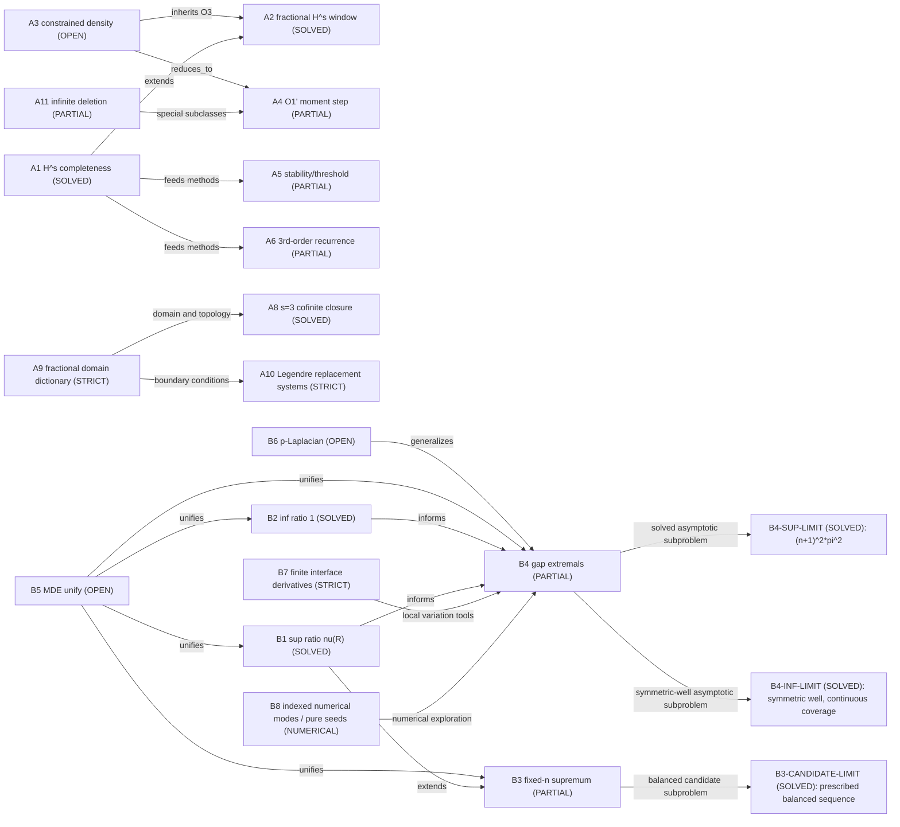

# Research map: Sturm-Liouville spectral optimization (BVE research)

Last updated: 2026-09-25 (round10 indexed spectrum/reflection-sector repair independently reviewed; numerical scope retained)


This is a project-wide, human-readable map of every problem being studied and
how the problems relate to each other. It is a living document: update it at
stage boundaries and whenever a problem, result, or relationship changes.

## How to read this map

- Each **node** is a research problem (with a stable id, name, status).
- Each **edge** is a relationship: `extends` (one generalizes another),
  `reduces_to` (one is a reduced core of another), `uses` (reuses a tool or
  result), `supersedes` (a newer result covers an older one), `unifies`.
- Statuses: `SOLVED` / `STRICT` (proved) / `PARTIAL` / `OPEN` / `NUMERICAL`.

## Entry points

- Overview of open problems: `docs/SL_spectral_topics_summary.tex` section 5.
- Project/ownership: `PROJECT.md`, `AGENTS.md`, `state/RESUME.md`.
- Runs: `runs/rigorous-open-math-research/`.
- Tools: `tools/` (+ index `tools/README.md`) and `knowledge/tools/`.
- Formalization state: `lean-proof/STATUS.md`, `lean-proof/LEMMA_INDEX.md`.

## Two research lines

### Line A - Left-definite theory / completeness of sparse polynomial systems

| Id | Problem | Status | Key result / pointer | Notes |
| --- | --- | --- | --- | --- |
| A1 | `{p_n}` density in genuine H^s, 0 <= s < 7/2 (Krein-Sobolev) | SOLVED | docs/SL_fractional_left_definite; H2/H3 proofs retained | Round6 four-trace graph core + spectral cutoff proves the full window; every nonaffine named member has threshold7/2, affine modes survive all nonnegative orders. No deleted-family or arbitrary-V extension |
| A2 | Fractional left-definite H^s, 3/2 <= s < 2, sparse basis | SOLVED | docs/SL_fractional_left_definite | covered by A1 via H3 density and spectral truncation, 2026-09-20; no claim for arbitrary constrained spaces |
| A3 | Density criterion in constrained subspace V = cap ker L_j, general (non-coordinate) H | OPEN (general); diagonal SOLVED as Theorem E | DensBC runs; tools/constrained-denseness | reduced core is A4 |
| A4 | O1' moment-representability + membership step | PARTIAL | 2026-08-16 run R-20260816T210000Z-densbc-o1p | CLOSED on H_beta + finite polynomial constraints; general H OPEN |
| A5 | Conditional moment-jump stability and actual-solution criterion | PARTIAL | docs/SL_stability_moment_jump | General product lower bound only; B=0 diagonal models classified; unconditional bounded basis-perturbation stability refuted (round 3) |
| A6 | Three-order recurrence theory (fixed point / closed forms / minimal solution) | PARTIAL | docs/SL_third_order_recurrence_theory; docs/SL_third_order_K1_proof.tex | specified even/odd P,Q,R: positive minimal solution and K0(c)/K1(c) for c>0, rational ratios classified in round4; nonhomogeneous source control and arbitrary families remain OPEN |
| A7 | Krein algebraic polynomial inverse versus operator power domain | STRICT | tools/krein-power-domain-polynomial-obstruction; pilot-v6-hs-domain/arms/a-plugin; arms/c-qed | for every c>0 and integer s>=4, membership holds exactly for n=0,1; genuine operator inverses are dense but generally non-polynomial; boundary-compatible polynomials form a graph core with exact degrees `{0,1} union {N:N>=2 floor(s/2)+2}` |
| A8 | Cofinite original-family closure at s=3 | SOLVED | literature/absorption-20260923/domains/proofs/03-s3-cofinite-closure.md; tools/krein-s3-cofinite-three-traces | Fixed c>0. Closure is determined exactly by retention of indices0,1,4, detecting f(0),f′(0),f″(0); high-tail sufficiency proved. No critical s=5/2 or general infinite-deletion conclusion |
| A9 | Concrete fractional and critical power-domain dictionary | STRICT | tools/krein-fractional-trace-dictionary; tools/krein-parity-unitary | All s≥0 in this smooth constant-coefficient model via full-interval Neumann/shifted-Robin bridge; ordinary boundary layers off3/2+2k and weighted critical residuals at equality |
| A10 | Boundary-compatible integrated Legendre replacement systems | STRICT | tools/krein-integrated-legendre-riesz; tools/finite-synthesis-tsvd | Fixed c>0, s=2/4; complete Riesz replacement systems with degree-independent constants and coefficient-tail errors. Not the original sparse monomials, uniform c→0 or quadrature certification |
| A11 | Infinite-deletion subclasses in Hc2 | PARTIAL | tools/krein-infinite-deletion-subclasses; tools/full-muntz-krein-moment-interface | Both parity branches containing arithmetic progressions give the two-centre-trace closure; reciprocal-summable retained parity sets obstruct density. General divergent nonarithmetic cases remain open |

### Line B - Eigenvalue ratios and spectral gaps of weighted Dirichlet SL

| Id | Problem | Status | Key result / pointer | Notes |
| --- | --- | --- | --- | --- |
| B1 | sup_{n,rho} lambda_{n+1}/lambda_n = nu(R) | SOLVED | docs/SL_ratio_proof | balanced-phase closed form |
| B2 | inf_{n,rho} lambda_{n+1}/lambda_n = 1 | SOLVED | docs/SL_inf_ratio_proof | Constant-density high modes suffice; inf not attained |
| B3 | Fixed-n supremum Lambda_n^sup(R) | PARTIAL | docs/SL_fixed_n_supremum | physical reflection has a frequency factor; normalized symmetry and all-n root count repaired in round9. Historical extremizer 2n-switch structure retains its scope; global equality/optimality O1/O2 OPEN |
| B3-CANDIDATE-LIMIT | Prescribed balanced candidate ratios c_n(R), fixed R>1 | SOLVED | docs/SL_fixed_n_supremum.tex; round9 analytic repair | Jacobi principal submatrix argument gives c_n strictly decreasing to ((pi-phi)/phi)^2, phi=arccos((sqrt(R)-1)/(sqrt(R)+1)). Does not identify c_n with the global supremum |
| B4 | Adjacent gap extremals D_n = lambda_{n+1}-lambda_n | PARTIAL | docs/SL_gap_n1_proof; docs/SL_gap_nge2_symmetry_local_proof; blueprint target CLM-SL-B4-M3-TARGET-V1 | n=1 all-R chain retained; n>=2 small-contrast uniqueness repaired in round7; general SUP limit is solved as B4-SUP-LIMIT below. M3/KP retain their explicit chart scopes; historical G2 labels still require statement alignment; finite-R global uniqueness remains OPEN |
| B4-SUP-LIMIT | lim_(R->infinity) sup_(1<=rho<=R) D_n, fixed n>=1 | SOLVED | docs/SL_gap_nge2_symmetry_local_proof.tex, round7 thin-heavy-interval theorem | Limit=(n+1)^2*pi^2 for measurable box and unrestricted finite-piecewise classes; 4*pi^2 only at n=1. Does not identify finite-R maximizing interfaces or prove every self-consistent branch reaches that limit |
| B4-INF-LIMIT | Symmetric [R,1,R] first-gap scaled infimum and near-minimizers | SOLVED | docs/SL_gap_n1_inf_limit_proof.tex; round8 report | R*m_R→M≈24.9438661384 with nonnegative O(1/R) error; near-minimizers require R*eta_R→0. Entire thin-layer region covered by continuous phase speed; large-w comparison has positive margin. T1 uses T2 analytically, not T3 numerical constants. No new all-box/nonsymmetric/n>=2 claim |
| B5 | MDE extremal measure unified theory | OPEN | docs/SL_spectral_topics_summary section 5 | unifies nodes/largest gap via extremal measures |
| B6 | p-Laplacian / nonlinear generalizations | OPEN | docs/SL_spectral_topics_summary section 5 | Wen-Zhou singularity technique scope |
| B7 | Local second variation along finite fixed-value moving interfaces | STRICT | tools/finite-interface-second-derivative; literature/absorption-20260923/interfaces/derivations | Ordered noncolliding internal interfaces, fixed positive block values, simple fixed mode; normalization, finite Green kernel, geometry and coordinate acceleration retained. No global sign/G1′ or arbitrary distribution-path differentiability |
| B8 | Indexed numerical spectrum and geometrically pure reflection seeds | NUMERICAL (independently reviewed) | reports/proof-audit-round10-20260925/REPORT.md; scripts/_sl_prufer.py | Continuous lifted phase locates each mode before refinement; seed sectors follow derivative -J and actual feasible displacement. Finite checks are not interval certification or G1/global uniqueness |

## Relationships between problems

```text
Line A:
A1 (H^s completeness, solved)
  |-- extends --> A2 (fractional window 3/2<=s<2, solved via H3)
  |-- uses moment-jump/growth-lemma --> A5 (stability, partial), A6 (3rd-order, partial)
A3 (constrained density, open)
  |-- reduces_to --> A4 (O1' moment-realizability, partial)
  A4 --uses--> round6 repaired projection/finite-obstacle criteria (docs/SL_projection_moment_repairs.tex); old run remains history
  A3 --historical O3--> A2 (Krein window now solved; general constraints separate)
A1 abstract polynomial transport --corrected_by--> A7 operator-domain obstruction
A9 parity/domain dictionary --supports--> A8 s3 cofinite three-trace closure
A9/A7 --guides--> A10 boundary-compatible replacement coordinates
A11 infinite-deletion subclasses --uses--> actual moment realization and Full Muntz; general A4 remains open

Line B:
B1 (sup ratio, solved)
  |-- extends --> B3 (fixed-n supremum, partial)
  |-- informs --> B4 (gap extremals, partial)
B2 (inf ratio, solved) --informs--> B4
B3 --uses--> Fixed-n configuration tools
B3 --solved candidate subproblem--> B3-CANDIDATE-LIMIT via nested Jacobi matrices
B7 local interface chain rule --supports--> B4 variation analysis; global sign remains open
B8 phase indexing + actual reflection sectors --repairs numerical exploration of--> B4/B7
B8 does not promote numerical observations to analytic G1 or global uniqueness
B4 --uses--> true-integral projection + normalized derivative + finite Green concentration; G1 remains OPEN
B4 --finite-R global gaps--> (G1') and scope-aligned boundary exclusion; M3 retains its finite-interior chart
B4 --solved subproblem--> B4-SUP-LIMIT via thin heavy intervals + min-max
B4 --solved symmetric-well subproblem--> B4-INF-LIMIT via phase speed + elementary A-doubleprime + analytic T2
B4-INF-LIMIT --separate numerical localization--> exact rational T3 (not a prerequisite of T1)
B5 (MDE unify) <--unifies--> B1,B2,B3,B4
B6 (p-Laplacian) <--generalizes--> B4

Cross-lines:
A-family (moment / operator-theoretic) and B-family (transfer-matrix / secular)
are mostly independent tool families; both rest on the spectral structure of
the SL operator. Left-definite completeness (A1) is the tool origin of several
moment/jump techniques reused in A4/A5.
```

## Mermaid overview



## Historical status (2026-08; consult the 2026-09 corrections before reuse)

- DensBC O1 (R-20260816T000000Z): historical structure inventory; sparse projection assertions superseded by round6
  (projection-density, obstruction system, run/first-obstruction, diagonal
  reduction, finite-rank structure); reduced core O1' (A4).
- DensBC O1' (R-20260816T210000Z): A4 closed on H_beta + finite polynomial
  constraints; exact criterion `dense <=> ker(T|B_adm) = {0}`; coordinate
  Theorem E reproduced; Example 7 non-coordinate obstruction. General O1'
  remains OPEN.
- leftdef-density (R-20260816T120000Z): STRICT L1-L6 with a concrete
  counterexample (V = ker Delta in H^2); open core O1'LD.
- min-direction audit (R-20260816T174722Z): ACCEPT with verification package.
- hs-operator-domain (historical run R-20260816T200000Z, pilot v6 2026-08-28):
  main obstruction/completion/non-density package is STRICT. For every `c>0`,
  integer `s>=4`, the algebraic transported polynomial `Q_n^(s)` belongs to
  `D(K_c^(s/2))` iff `n in {0,1}`. The abstract polynomial completion is not
  the operator domain under the identity, although a boundary-correcting unitary
  relates them. The larger space `C[x] intersect D(K_c^(s/2))` is a STRICT
  graph core. Its exact nonzero polynomial degree spectrum is also STRICT:
  `{0,1} union {N:N>=2 floor(s/2)+2}`.
- A6 root-1 no-go (plugin performance experiment 2026-08-22): root-1 branch
  higher-degree rational product exclusion STRICT partial (independent audit
  REPAIRABLE_GAP repaired); the root-0/minimal branch was open at that date and is now covered for the specified P,Q,R family by the 2026-09-21 fourth-round proof.
- A6 c=1 anchor (R-20260824T184147Z-k1-e4-ab, 2026-08-25): the even minimal
  solution has a standalone STRICT proof of K(1)=e/4. Its then-open general-c
  extension is covered by the 2026-09-21 fourth-round proof for the same explicit
  coefficient family. Nonhomogeneous source control and arbitrary families remain OPEN.
- DensBC O1' baseline (plugin performance experiment round 3, R-20260823T000000Z-o1p-baseline): new STRICT finite-rank criterion for stable banded-shift H_shift(m,lambda) (bandwidth m>=1, finite polynomial representers): density <=> ker(T|B_fin)={0}; bandwidth-2 v_1=x^4 non-dense; general O1' remains open.
- DensBC O1' light-reuse (plugin performance experiment round 3, R-20260823T000000Z-o1p-lightreuse): new STRICT weighted-shift H_{beta,lambda} criterion: density <=> ker(T|B_adm)={0}, B_adm includes infinite runs iff beta>3/2; unifies H_beta/H_lambda; general O1' remains open (audit REPAIRABLE_GAP repaired).
- O1'LD (2026-09-21 fifth-round correction): old Claim4 tail-L2 rigidity, unconditional cofinite-N density and proper-V corollary are REFUTED by central-trace Green kernels, not merely unproved. Lemma1 finite-deletion monomial totality retains its conclusion with a corrected proof. The s=2 cofinite two-trace classification has passed independent analytic review; its revised card is released; see reports/proof-audit-round5-20260921/REPORT.md and docs/SL_cofinite_left_definite.tex. Those two questions were open at that date. The s=3 cofinite case is now A8; A11 handles only the stated infinite-deletion subclasses. General non-cofinite O1'LD remains open.
- B3 current (plugin performance experiment round 4, R-20260823T060000Z-b3-current):
  new STRICT general equal-within-type alternating Chebyshev secular representation
  `(M_n)_01 = sin(p)[U_n(m)+delta U_{n-1}(m)]`, `delta=sin(q)/(s sin(p))`;
  amplitude-equality corollary from E=0; O1/O2 remain open (EVIDENCE for maxima).
- B3 baseline (plugin performance experiment round 2, R-20260822T220000Z-b3-baseline):
  new STRICT (i) every fixed-n ratio maximizer is bang-bang `[1,R,1,...,1]` with exactly 2n switches
  (ratio energy invariant E=0, q0=1/c, q1=-1/c);
  (ii) alternating balanced secular `F_n` has exactly 2n simple roots in (0,pi)
  (transfer-matrix recurrence + Chebyshev/Jacobi argument). This closes O3; O1 equal-width/value and O2 monotonicity remain open.

## Tools shared across problems

- Left-definite / moment side: `balanced-phase`, `transfer-matrix-secular`,
  `prufer-phase`, `sturm-oscillation`, `moment-jump-recurrence`,
  `left-definite-moment-recurrence`, `kp-constrained-denseness`,
  `run-free-base` (O1'), `banded-shift-toeplitz-density` (stable banded-shift O1' finite-rank criterion), `weighted-shift-beta-lambda-density` (weighted-shift O1' criterion).
- Ratio/gap side: `balanced-phase`, `transfer-matrix-secular`,
  `bang-bang`, `keller-variational`, `mw-periodic-extension`,
  `r1plus-perturbation-sheet`, `gap-band-extremals`,
  `general-alternating-secular-chebyshev` (round 4).
- Cross: `cell-merging`, `half-problem-regularized-green`.

## What to update next

- Promotion of A4: if O1' general (or a wider structured family) is resolved,
  mark A4 SOLVED and update A3.
- B3/B4: if (G1')/(G2) or fixed-n global extremality is proved, mark
  corresponding PARTIAL nodes SOLVED and link the proof/tool.
- Add new problem nodes as they appear (e.g. operator-domain results).

## Routes and methods tried
| densbc-o1p2|solver|PARTIAL-SUCCEEDED|O1' closed on H_lambda (banded non-diagonal) + finite polynomial representers: density <=> ker(T|B_fin)={0}; v_1=x^4 non-dense for all lambda |

| densbc-o1p2|solver|PARTIAL(in-progress)|banded / finitely-supported representer-moment extension of O1' |

## Intermediate results and unexpected findings

- lean-proof/LEMMA_INDEX.md regenerated (487 declarations) to reuse existing formalizations; performance test points P1-P6 in reports/plugin-performance-test-round2.md

## Failed attempts and failure reasons

- single representer density-holding search in H_lambda found no candidate in tried grids (EVIDENCE only)

## Avoid list (dead ends)

- do not claim general banded-O1' from H_lambda alone; realizability in general banded H needs moment-problem data

Round6 (2026-09-21): A3/A4 must use the corrected sparse projection and finite-tail-obstacle criteria. The all-polynomial projection theorem remains true; the unqualified sparse corollary does not. A7 concerns a distinct inverse-family/domain construction; the new full original-family threshold does not overwrite its scoped result. See reports/proof-audit-round6-20260921/REPORT.md.

## Round8 research knowledge (2026-09-22)

- Reusable phase-speed bound: for the symmetric three-layer string, all R>=1 and 0<u<1/2 satisfy G>=pi^2/[2epsilon(w+ell)(w+epsilon*ell)]. True mode indexing and the continuously unwrapped angle are part of the contract.
- The failed rectangle route omitted curved B/D strips, arbitrarily small w and part of the R-infinity tail. A finer grid does not repair inward coverage. Historical scripts remain unchanged; the current proof replaces their role.
- Fixed-u 1/R expansion and optimized-value O(1/R) are separate statements: the latter also uses the global lower bound. The exact optimized coefficient and parameter rate have not been proved here.
- Possible next idea, not a theorem: propagate unwrapped angle derivatives through more layers or general transfer matrices to obtain uniform mode separation. Each interface, mode index and parameter domain must be re-established.

Four revised card versions and their exact issue releases are linked from reports/proof-audit-round8-20260922/REPORT.md. This human research map update does not change canonical Blueprint.

## Round9 research knowledge (2026-09-23)

- Tangency depends on the integral functional A, while the chosen projection metric determines which normal represents it. Unequal block widths expose the lost factors in projection against averages. Zero A means every direction is tangent; it does not license division by zero.
- Spectral perturbation formulas must retain the component fixing the moving weighted normalization. The exact h=rho check gives u'=-u/2 and distinguishes this derivative from a reduced-inverse particular solution.
- In regular one-dimensional Dirichlet problems the Green finite part is bounded. Unit-mass midpoint pulses at rho=1 give lambda1''→6*pi², lambda2''→0 and half-gap Q→−3*pi². This refutes the divergence argument, not every possible finite-kernel/interface route. Actual moving-interface acceleration remains a separate finite contribution.
- Reflection of the physical secular value includes y/(pi-y); multiplying by the nonzero frequency preserves its zeros but changes its value law. An all-n Jacobi compression then turns a former candidate-limit conjecture into a proof, while leaving global optimality separate.
- Possible next idea, unproved: combine the finite regularized-kernel matrix with the correctly signed interface acceleration on the actual tangent space. First test against the constant-density midpoint limit and width-unequal directions; establish analytic concentration/tail control before attempting a sign theorem. A numerical negative direction alone is insufficient for the constrained extremum problem.

Current proofs, correction receipts and version-bound annotations are linked from reports/proof-audit-round9-20260923/REPORT.md. Historical R206 and older B3 runs retain original bytes and dated claims. Canonical Blueprint was not changed.

## Literature absorption (2026-09-23)

P0-P4 connects13 source records to11 scoped tool cards.12 primary originals were available for targeted reading; L13 remains metadata/incomplete preview only. L02's second-left-definite object is matched to the existing project result, and L12's first-pair switching mechanism is attributed to its original source. Its numerically described C(1,4) region and unverified L13 constraints do not certify all-R novelty. Exact source-to-claim mappings, independent reviews and subsequent research contracts are in [the batch entry](literature/absorption-20260923/README.md).

The finite exact checks do not prove Sobolev closure or spectral analysis. New results have scoped independent analytic review; no new Lean formalization or canonical Blueprint integration was performed. The old full-family threshold, O1/O2 and global G1′ retain their exact scopes.
