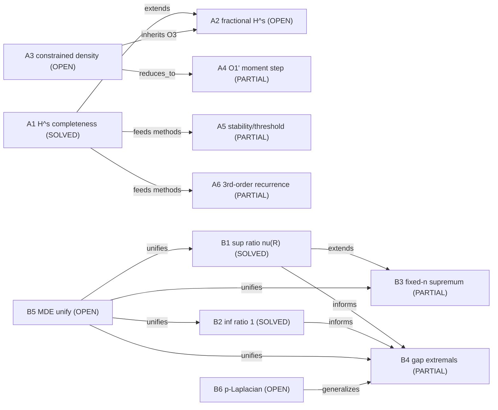

# Research map: Sturm-Liouville spectral optimization (BVE research)

Last updated: 2026-08-18T16:41:48.400295Z


This is a project-wide, human-readable map of every problem being studied and
how the problems relate to each other. It is a living document: update it at
stage boundaries and whenever a problem, result, or relationship changes.

## How to read this map

- Each **node** is a research problem (with a stable id, name, status).
- Each **edge** is a relationship: `extends` (one generalizes another),
  `reduces_to` (one is a reduced core of another), `uses` (reuses a tool or
  result), `supersedes` (a newer result covers an older one), `unifies`.
- Statuses: `SOLVED` / `STRICT` (proved) / `PARTIAL` / `OPEN` / `NUMERICAL`.

## Entry points

- Overview of open problems: `docs/SL_spectral_topics_summary.tex` section 5.
- Project/ownership: `PROJECT.md`, `AGENTS.md`, `state/RESUME.md`.
- Runs: `runs/rigorous-open-math-research/`.
- Tools: `tools/` (+ index `tools/README.md`) and `knowledge/tools/`.
- Formalization state: `lean-proof/STATUS.md`, `lean-proof/LEMMA_INDEX.md`.

## Two research lines

### Line A - Left-definite theory / completeness of sparse polynomial systems

| Id | Problem | Status | Key result / pointer | Notes |
| --- | --- | --- | --- | --- |
| A1 | `{p_n}` analytic completeness in H^s [-1,1], all integer s >= 1 (Krein-Sobolev) | SOLVED | docs/SL_h2_completeness_proof, SL_h3_completeness_proof, SL_hs_orthogonal_systems | moment-jump + growth lemma + Weierstrass |
| A2 | Fractional left-definite H^s, 3/2 <= s < 2, sparse basis | OPEN | docs/SL_fractional_left_definite | inherits DensBC O3 window |
| A3 | Density criterion in constrained subspace V = cap ker L_j, general (non-coordinate) H | OPEN (general); diagonal SOLVED as Theorem E | DensBC runs; tools/constrained-denseness | reduced core is A4 |
| A4 | O1' moment-representability + membership step | PARTIAL | 2026-08-16 run R-20260816T210000Z-densbc-o1p | CLOSED on H_beta + finite polynomial constraints; general H OPEN |
| A5 | Stability / threshold-line classification (moment-jump) | PARTIAL | docs/SL_stability_moment_jump | threshold line family ~ log m not fully classified |
| A6 | Three-order recurrence theory (fixed point / closed forms / minimal solution) | PARTIAL | docs/SL_third_order_recurrence_theory | root-1 high-degree rational no-go STRICT partial (2026-08-22); root-0/minimal and other gaps open |

### Line B - Eigenvalue ratios and spectral gaps of weighted Dirichlet SL

| Id | Problem | Status | Key result / pointer | Notes |
| --- | --- | --- | --- | --- |
| B1 | sup_{n,rho} lambda_{n+1}/lambda_n = nu(R) | SOLVED | docs/SL_ratio_proof | balanced-phase closed form |
| B2 | inf_{n,rho} lambda_{n+1}/lambda_n = 1 | SOLVED | docs/SL_inf_ratio_proof | Weyl asymptotic; inf not attained |
| B3 | Fixed-n supremum Lambda_n^sup(R) | PARTIAL | docs/SL_fixed_n_supremum | reflection symmetry STRICT; ratio-extremizer exact-2n-switch structure STRICT (2026-08-22); 2n root count STRICT (2026-08-22); equal-width optimum O2 and global value O1 OPEN |
| B4 | Adjacent gap extremals D_n = lambda_{n+1}-lambda_n | PARTIAL | docs/SL_gap_n1_proof etc. | n=1 SOLVED; n>=2 local symmetry STRICT, global needs (G1')/(G2); M3 large-R balance partial |
| B5 | MDE extremal measure unified theory | OPEN | docs/SL_spectral_topics_summary section 5 | unifies nodes/largest gap via extremal measures |
| B6 | p-Laplacian / nonlinear generalizations | OPEN | docs/SL_spectral_topics_summary section 5 | Wen-Zhou singularity technique scope |

## Relationships between problems

```text
Line A:
A1 (H^s completeness, solved)
  |-- extends --> A2 (fractional window 3/2<=s<2, open)
  |-- uses moment-jump/growth-lemma --> A5 (stability, partial), A6 (3rd-order, partial)
A3 (constrained density, open)
  |-- reduces_to --> A4 (O1' moment-realizability, partial)
  A4 --uses--> run R-20260816T000000Z-densbc-o1 structure theorems
  A3 --inherits O3--> A2 (fractional window)

Line B:
B1 (sup ratio, solved)
  |-- extends --> B3 (fixed-n supremum, partial)
  |-- informs --> B4 (gap extremals, partial)
B2 (inf ratio, solved) --informs--> B4
B3 --uses--> Fixed-n configuration tools
B4 --depends on--> (G1'), (G2), M3 large-R balance
B5 (MDE unify) <--unifies--> B1,B2,B3,B4
B6 (p-Laplacian) <--generalizes--> B4

Cross-lines:
A-family (moment / operator-theoretic) and B-family (transfer-matrix / secular)
are mostly independent tool families; both rest on the spectral structure of
the SL operator. Left-definite completeness (A1) is the tool origin of several
moment/jump techniques reused in A4/A5.
```

## Mermaid overview



## Recent status (2026-08)

- DensBC O1 (R-20260816T000000Z): STRICT structure theorems for O1
  (projection-density, obstruction system, run/first-obstruction, diagonal
  reduction, finite-rank structure); reduced core O1' (A4).
- DensBC O1' (R-20260816T210000Z): A4 closed on H_beta + finite polynomial
  constraints; exact criterion `dense <=> ker(T|B_adm) = {0}`; coordinate
  Theorem E reproduced; Example 7 non-coordinate obstruction. General O1'
  remains OPEN.
- leftdef-density (R-20260816T120000Z): STRICT L1-L6 with a concrete
  counterexample (V = ker Delta in H^2); open core O1'LD.
- min-direction audit (R-20260816T174722Z): ACCEPT with verification package.
- hs-operator-domain (R-20260816T200000Z): in progress partial.
- A6 root-1 no-go (plugin performance experiment 2026-08-22): root-1 branch
  higher-degree rational product exclusion STRICT partial (independent audit
  REPAIRABLE_GAP repaired); root-0/minimal branch remains open.
- DensBC O1' baseline (plugin performance experiment round 3, R-20260823T000000Z-o1p-baseline): new STRICT finite-rank criterion for stable banded-shift H_shift(m,lambda) (bandwidth m>=1, finite polynomial representers): density <=> ker(T|B_fin)={0}; bandwidth-2 v_1=x^4 non-dense; general O1' remains open.
- DensBC O1' light-reuse (plugin performance experiment round 3, R-20260823T000000Z-o1p-lightreuse): new STRICT weighted-shift H_{beta,lambda} criterion: density <=> ker(T|B_adm)={0}, B_adm includes infinite runs iff beta>3/2; unifies H_beta/H_lambda; general O1' remains open (audit REPAIRABLE_GAP repaired).
- B3 baseline (plugin performance experiment round 2, R-20260822T220000Z-b3-baseline):
  new STRICT (i) every fixed-n ratio maximizer is bang-bang `[1,R,1,...,1]` with exactly 2n switches
  (ratio energy invariant E=0, q0=1/c, q1=-1/c);
  (ii) alternating balanced secular `F_n` has exactly 2n simple roots in (0,pi)
  (transfer-matrix recurrence + Chebyshev/Jacobi argument). This closes O3; O1 equal-width/value and O2 monotonicity remain open.

## Tools shared across problems

- Left-definite / moment side: `balanced-phase`, `transfer-matrix-secular`,
  `prufer-phase`, `sturm-oscillation`, `moment-jump-recurrence`,
  `left-definite-moment-recurrence`, `kp-constrained-denseness`,
  `run-free-base` (O1'), `banded-shift-toeplitz-density` (stable banded-shift O1' finite-rank criterion), `weighted-shift-beta-lambda-density` (weighted-shift O1' criterion).
- Ratio/gap side: `balanced-phase`, `transfer-matrix-secular`,
  `bang-bang`, `keller-variational`, `mw-periodic-extension`,
  `r1plus-perturbation-sheet`, `gap-band-extremals`.
- Cross: `cell-merging`, `half-problem-regularized-green`.

## What to update next

- Promotion of A4: if O1' general (or a wider structured family) is resolved,
  mark A4 SOLVED and update A3.
- B3/B4: if (G1')/(G2) or fixed-n global extremality is proved, mark
  corresponding PARTIAL nodes SOLVED and link the proof/tool.
- Add new problem nodes as they appear (e.g. operator-domain results).

## Routes and methods tried
| densbc-o1p2|solver|PARTIAL-SUCCEEDED|O1' closed on H_lambda (banded non-diagonal) + finite polynomial representers: density <=> ker(T|B_fin)={0}; v_1=x^4 non-dense for all lambda |

| densbc-o1p2|solver|PARTIAL(in-progress)|banded / finitely-supported representer-moment extension of O1' |

## Intermediate results and unexpected findings

- lean-proof/LEMMA_INDEX.md regenerated (487 declarations) to reuse existing formalizations; performance test points P1-P6 in reports/plugin-performance-test-round2.md

## Failed attempts and failure reasons

- single representer density-holding search in H_lambda found no candidate in tried grids (EVIDENCE only)

## Avoid list (dead ends)

- do not claim general banded-O1' from H_lambda alone; realizability in general banded H needs moment-problem data
